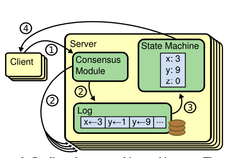
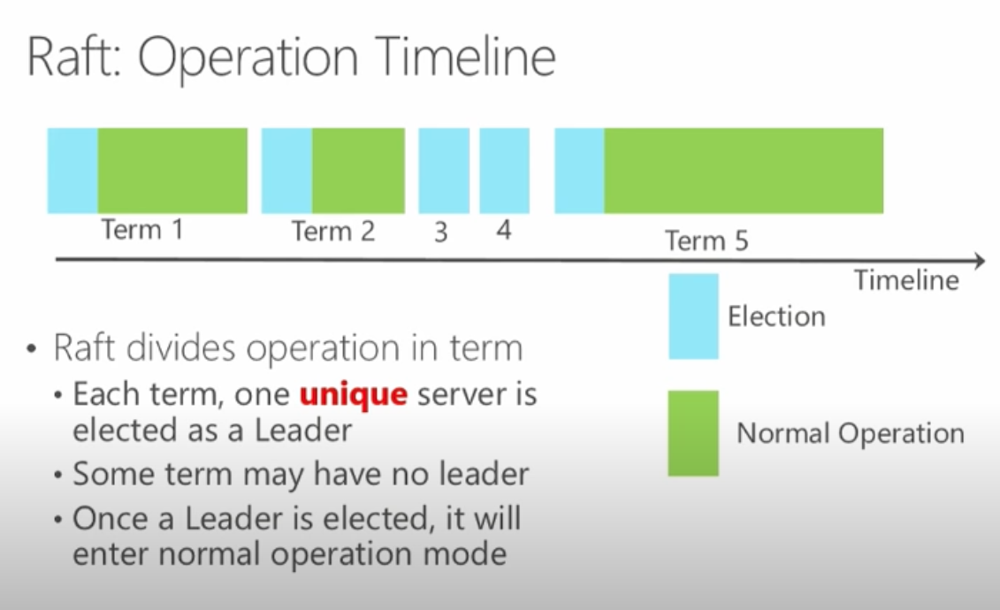

# Raft Consensus Algorithm (Functionalty, Safety & Availability )

It's equivalent to Paxos in fault-tolerance and performance. The difference is that it's decomposed into relatively independent subproblems, and it cleanly addresses all major pieces needed for practical systems. We hope Raft will make consensus available to a wider audience, and that this wider audience will be able to develop a variety of higher quality consensus-based systems than are available today.

### Hightlights

-   Concept: Replicated Log for Replicated State Machine
-   Leader Election: Key (First elected leader, then normal operation)
-   Log Maintenance: Leader's Log is replicated to all Followers
-   TLA + Spec: Close to developer's implementation & usage
-   State Space: Large

> TLA: Temporal logic of actions

### Exist Way for Consensus

**Strong leader**

Raft uses a stronger form of leadership than other consensus algorithms. For example,
log entries only flow from the leader to other servers.
This simplifies the management of the replicated log
and makes Raft easier to understand

**Leader election**

Raft uses <a href="./consensus.md">randomized</a> timers to
elect leaders. This adds only a small amount of
mechanism to the heartbeats already required for any
consensus algorithm, while resolving conflicts simply and rapidly.

**Membership changes**

Raft’s mechanism for
changing the set of servers in the cluster uses a new
joint consensus approach where the majorities of
two different configurations overlap during transitions. This allows the cluster to continue operating
normally during configuration changes.

## Replicated state machines

Replicated state machines are typically implemented
using a replicated log, as shown in Figure 1. Each server
stores a log containing a series of commands, which its
state machine executes in order. Each log contains the
same commands in the same order, so each state machine processes the same sequence of commands. Since
the state machines are deterministic, each computes the
same state and the same sequence of outputs.

Keeping the replicated log consistent is the job of the
consensus algorithm. The consensus module on a server
receives commands from clients and adds them to its log.
It communicates with the consensus modules on other
servers to ensure that every log eventually contains the
same requests in the same order, even if some servers fail.
Once commands are properly replicated, each server’s
state machine processes them in log order, and the outputs are returned to clients. As a result, the servers appear
to form a single, highly reliable state machine.

Consensus algorithms for practical systems typically
have the following properties

-   They ensure safety (never returning an incorrect result) under all non-Byzantine conditions, including
    network delays, partitions, and packet loss, duplication, and reordering

-   They are fully functional (available) as long as any
    majority of the servers are operational and can communicate with each other and with clients. Thus, a
    typical cluster of five servers can tolerate the failure
    of any two servers. Servers are assumed to fail by
    stopping; they may later recover from state on stable
    storage and rejoin the cluster.

-   They do not depend on timing to ensure the consistency of the logs: faulty clocks and extreme message
    delays can, at worst, cause availability problems.

-   In the common case, a command can complete as
    soon as a majority of the cluster has responded to a
    single round of remote procedure calls; a minority of
    slow servers need not impact overall system performance.

## Designing for Understandability

It must provide a complete and practical foundation for system building, so that it significantly reduces the amount of design work required of developers; it must be safe under all conditions and available under typical operating conditions; and it must be efficient for common operations. But our most important goal—and most difficult challenge—was un- derstandability. It must be possible for a large audience to understand the algorithm comfortably

Our second approach was to simplify the state space by reducing the number of states to consider, making the system more coherent and eliminating nondeterminism where possible. Specifically, logs are not allowed to have holes, and Raft limits the ways in which logs can become inconsistent with each other. Although in most cases we tried to eliminate nondeterminism, there are some situ- ations where nondeterminism actually improves under- standability. In particular, randomized approaches intro- duce nondeterminism, but they tend to reduce the state space by handling all possible choices in a similar fashion (“choose any; it doesn’t matter”).

## The Raft consensus algorithm

Raft implements consensus by first electing a distin- guished leader, then giving the leader complete responsi- bility for managing the replicated log. The leader accepts log entries from clients, replicates them on other servers, and tells servers when it is safe to apply log entries to their state machines. Having a leader simplifies the man- agement of the replicated log. For example, the leader can decide where to place new entries in the log without con- sulting other servers, and data flows in a simple fashion from the leader to other servers. A leader can fail or be- come disconnected from the other servers, in which case a new leader is elected

Given the leader approach, Raft decomposes the con- sensus problem into three relatively independent subprob- lems, which are discussed in the subsections that follow;

**Leader election** a new leader must be chosen when an existing leader fails

**Log replication** the leader must accept log entries

## Raft: Operation Timeline

