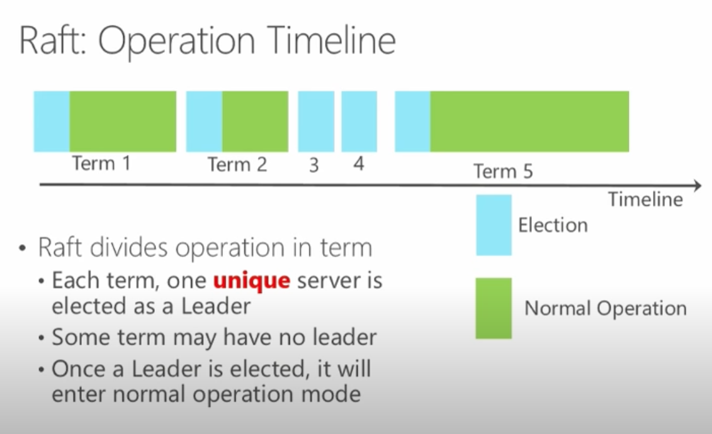

# Raft Consensus Algorithm (Functionalty, Safety & Availability )

It's equivalent to Paxos in fault-tolerance and performance. The difference is that it's decomposed into relatively independent subproblems, and it cleanly addresses all major pieces needed for practical systems. We hope Raft will make consensus available to a wider audience, and that this wider audience will be able to develop a variety of higher quality consensus-based systems than are available today.

### Hightlights

-   Concept: Replicated Log for Replicated State Machine
-   Leader Election: Key (First elected leader, then normal operation)
-   Log Mainenance: Leader's Log is replicated to all Followers
-   TLA + Spec: Close to developer's implementation & usage
-   State Space: Large

> TLA: Temporal logic of actions

## Raft Operation Timeline

